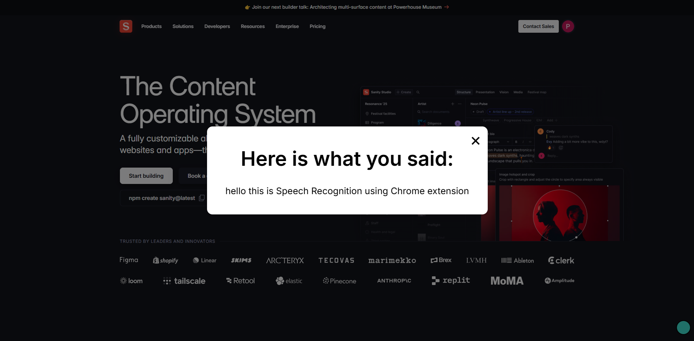

### **Being Qurious - Speech Recognition Chrome Extension**

**Being Qurious** is a Chrome extension that allows users to recognize speech and display the transcribed text using a popup. With a simple keyboard shortcut or button click, users can start or stop voice recognition and view the captured text.

---

## **Features**
✅ **Real-time Speech Recognition** – Converts spoken words into text dynamically  
✅ **Keyboard Shortcut Support** – Press `Shift + Alt + Q` to toggle speech recognition  
✅ **Popup Display** – Shows transcribed text when recognition stops  
✅ **Minimalist UI** – A floating button to start/stop recording  

---

## **Installation**
1. Download or clone this repository.  
2. Open **Chrome** and navigate to `chrome://extensions/`.  
3. Enable **Developer Mode** (toggle in the top-right corner).  
4. Click **Load unpacked** and select the project folder.  
5. The extension will be installed and ready to use!  

---

## **Usage**
### **Method 1: Click the Button**
- A floating button appears on all webpages.  
- Click the button to **start** listening.  
- Click again to **stop** and display the transcript.  

### **Method 2: Keyboard Shortcut**
- Press `Shift + Alt + Q` to start or stop listening.  
- The transcribed text will be displayed in an alert popup.  

---

## **Project Structure**
📂 `Being-Qurious/`  
 ├── 📁 `scripts/` – Contains `content.js` (core functionality) and `popup.js`  
 ├── 📁 `css/` – Stylesheet for the content script  
 ├── 📁 `images/` – Icons used for the extension  
 ├── 📄 `manifest.json` – Chrome extension configuration  
 ├── 📄 `README.md` – This documentation  

---

## **Future Improvements**
🚀 Improve UI with a better-designed transcript popup  
🚀 Add support for multiple languages  
🚀 Implement settings page for customization  

---

## **License**
This project is **open-source** and available under the MIT License.  

